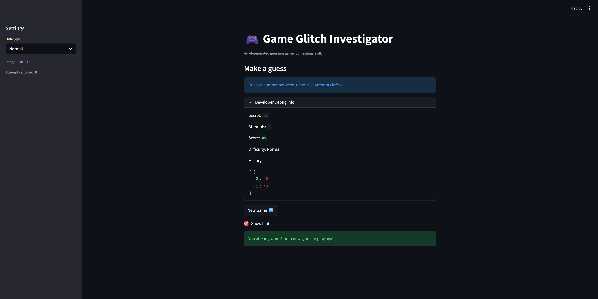

# 🎮 Game Glitch Investigator: The Impossible Guesser

## 🚨 The Situation

You asked an AI to build a simple "Number Guessing Game" using Streamlit.
It wrote the code, ran away, and now the game is unplayable.

- You can't win.
- The hints lie to you.
- The secret number seems to have commitment issues.

## 🛠️ Setup

1. Install dependencies with `uv sync` or `uv pip install -r requirements.txt`
2. Run the app with `uv run python -m streamlit run app.py`
3. Run the manual logic checks with `uv run python tests/test_game_logic.py`

## 🕵️‍♂️ Your Mission

1. **Play the game.** Open the "Developer Debug Info" tab in the app to see the secret number. Try to win.
2. **Find the State Bug.** Why does the secret number change every time you click "Submit"? Ask ChatGPT: *"How do I keep a variable from resetting in Streamlit when I click a button?"*
3. **Fix the Logic.** The hints ("Higher/Lower") are wrong. Fix them.
4. **Refactor & Test.**
   - Move the logic into `logic_utils.py`.
   - Run the manual test script in your terminal.
   - Keep fixing until all checks pass.

## 📝 Document Your Experience

- [x] Describe the game's purpose.
  The app is a small Streamlit number guessing game where the player tries to find a secret number within a limited number of attempts while receiving hints after each guess.
- [x] Detail which bugs you found.
  The biggest bugs were reversed hint text, inconsistent comparisons caused by converting the secret number to a string on some turns, duplicated logic living in `app.py` instead of `logic_utils.py`, and attempt tracking that started off by one.
- [x] Explain what fixes you applied.
  I moved the core rules into `logic_utils.py`, fixed the comparison and hint logic, kept the secret number stable in `st.session_state`, reset the game cleanly by difficulty, corrected attempt/score handling, and added manual runnable tests for the logic helpers.

## 📸 Demo

## 🚀 Stretch Features

- [ ] [If you choose to complete Challenge 4, insert a screenshot of your Enhanced Game UI here]
